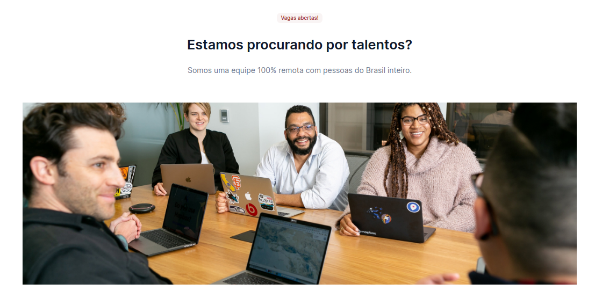
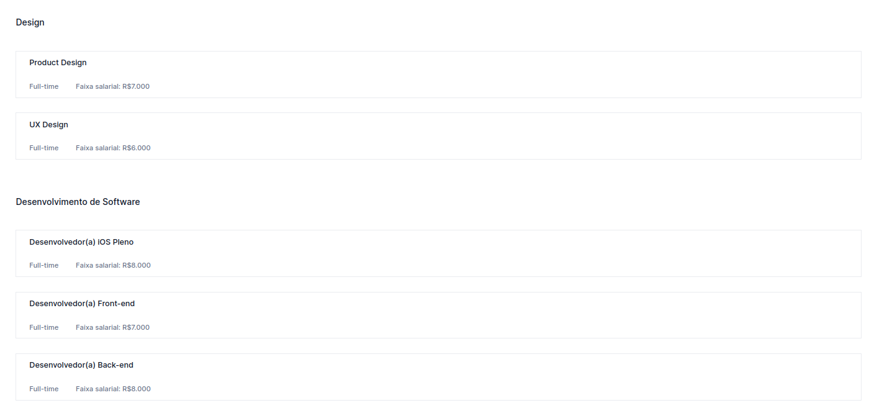
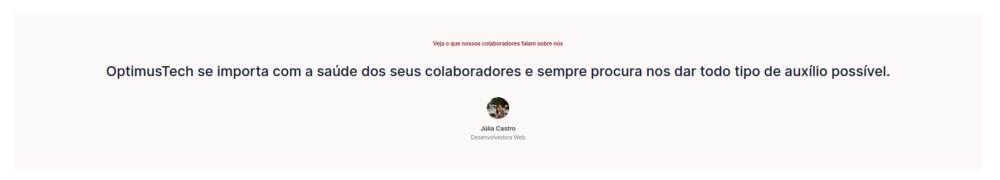

# OptimusTech

This project is based on 7DaysOfCode is a Alura's challenge that was indicated to do at the end of the  "From zero: HTML e CSS to web projects" formation.

1. Challenge First Day

- Create the header of the page

2. Challenge Second Day

- Create the first section with some informations

3. Challenge Third Day

- Create section with metrical informations

4. Challenge Fourth Day

- Create section looking for a job with image

5. Challenge Fifth Day

- Create section about available jobs

6. Challenge Sixth Day

- Create section about depositions

