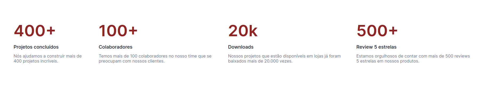

# OptimusTech

This project is based on 7DaysOfCode is a Alura's challenge that was indicated to do at the end of the  "From zero: HTML e CSS to web projects" formation.

1. Challenge First Day

Create the header of the page

2. Challenge Second Day

Create the first section with some informations

3. Challenge Third Day

Create section with metrical informations

